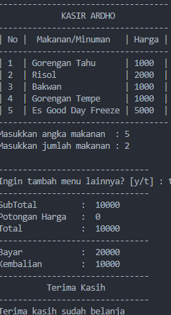

# ProjectUAS

## Profil

| Variable        | Isi                 |
| --------------- | ------------------- |
| **Nama**        | Ahmad Ridho Septian |
| **NIM**         | 312310447           |
| **Kelas**       | TI.23.A.5           |
| **Mata Kuliah** | Bahasa Pemrograman  |

## PROJECT UAS

## CODINGAN

`````Py
import sys
total = []

print("--------------------------")
print("         Kasir Ardho      ")
print("-------------------------------")

def daftar_barang():
    print("| No |  Makanan/Minuman   | Harga |")
    print("-------------------------------")
    print("| 1  | Gorengan Tahu      | 1000  |")
    print("| 2  | Risol              | 2000  |")
    print("| 3  | Bakwan             | 1000  |")
    print("| 4  | Gorengan Tempe     | 1000  |")
    print("| 5  | Es Good Day Freeze | 5000  |")

    print("-------------------------------")
    kode = int(input("Masukkan no makanan  : "))
    if kode == 1:
        jumlah1 = int(input("Masukkan jumlah pesanan : "))
        total1 = 1000 * jumlah1
        total.append(total1)
        tanya()
    elif kode == 2:
        jumlah2 = int(input("Masukkan jumlah pesanan : "))
        total2 = 2000 * jumlah2
        total.append(total2)
        tanya()
    elif kode == 3:
        jumlah3 = int(input("Masukkan jumlah pesanan : "))
        total3 = 1000 * jumlah3
        total.append(total3)
        tanya()
    elif kode == 4:
        jumlah4 = int(input("Masukkan jumlah pesanan : "))
        total4 = 1000 * jumlah4
        total.append(total4)
        tanya()
    elif kode == 5:
        jumlah5 = int(input("Masukkan jumlah pesanan : "))
        total5 = 5000 * jumlah5
        total.append(total5)
        tanya()
    return
def tanya():
    print("\n-------------------------------")
    tanya = input("Ingin tambah menu lainnya? [y/t] : ")
    print("-------------------------------")
    if tanya == "y":
        daftar_barang()
    elif tanya == "t":
        akhir()
    else:
        print("Pilihan yang anda masukan salah!")

def akhir():
    for harga in total:
        print("SubTotal         : ", sum(total))
        diskon = 0
        a = sum(total)
        if a > 500000:
            diskon = a * 8/100
        elif a > 300000:
            diskon = a * 5/100
        elif a > 200000:
            diskon = a * 3/100
        elif a > 100000:
            diskon = a * 1/100
        else:
            diskon = 0
        print("Potongan Harga   : ", diskon)
        totalakhir = a - diskon
        print("Total            : ", totalakhir)
        print("-------------------------------")
        bayar = int(input("Bayar            :  "))
        kembalian = bayar - totalakhir
        print("Kembalian        : ", kembalian)
        print("-------------------------------")
        print("          Terima Kasih         ")
        print("-------------------------------")
        print("Terima kasih sudah belanja ")
daftar_barang()

## PENJELASAN
def daftar_barang():

    Fungsi untuk membuat atau menampilkan daftar barang.
    Cara Penggunaan:
    1. Panggil fungsi daftar_barang().
    2. Input nama makanan dan harga ketika diminta.
    3. Ulangi langkah 2 untuk menambahkan lebih memperbanyak menu .
    4. Ketik 'selesai' untuk menyelesaikan input.
    5. Fungsi akan menampilkan daftar barang beserta total harga.
    ````
## Contoh Pengunaan fungsi def
>>> daftar_barang()
    Input nama makanan (ketik 'selesai' untuk mengakhiri): Risol
    Input harga makanan: 1000
    Input nama makanan (ketik 'selesai' untuk mengakhiri): Ayam Geprek
    Input harga makanan: 15000
    Input nama makanan (ketik 'selesai' untuk mengakhiri): Good day Freze
    Input harga makanan: 50000
    Input nama makanan (ketik 'selesai' untuk mengakhiri): selesai

             Kasir Ardho
-------------------------------
| No |  Makanan/Minuman   | Harga |
-------------------------------
| 1  | Gorengan Tahu      | 1000  |
| 2  | Risol              | 2000  |
| 3  | Bakwan             | 1000  |
| 4  | Gorengan Tempe     | 1000  |
| 5  | Es Good Day Fresh  | 5000  |

-------------------------------
Masukkan no makanan  : 5
Masukan jumlah pesanan :2

-------------------------------
Ingin tambah menu lainnya? [y/t] : t
-------------------------------
SubTotal         :  10000
Potongan Harga   :  0
Total            :  10000
-------------------------------
Bayar            :  20000
Kembalian        :  10000
-------------------------------
          Terima Kasih
-------------------------------


## Penjelasan
kode = int(input("Masukkan no makanan  : "))
    if kode == 1:
        jumlah1 = int(input("Masukkan jumlah pesanan : "))
        total1 = 1000 * jumlah1
        total.append(total1)
        tanya()

 -kode = int(input("Masukkan no makanan : ")): Mengambil input dari pengguna dalam bentuk nomor makanan dan mengonversinya ke tipe data
 integer.

 -if kode == 1:: Melakukan pengecekan apakah nomor makanan yang dimasukkan pengguna sama dengan 1.

 -jumlah1 = int(input("Masukkan jumlah pesanan : ")): Jika nomor makanan yang dimasukkan adalah 1, program akan meminta pengguna untuk    memasukkan jumlah pesanan makanan tersebut dan mengonversinya ke tipe data integer.

 -total1 = 1000 * jumlah1: Menghitung total biaya pesanan makanan dengan mengalikan harga makanan (dalam contoh ini, 1000) dengan jumlah pesanan.

 -total.append(total1): Menambahkan total biaya pesanan ke dalam sebuah list bernama total.

 -tanya(): Memanggil fungsi tanya(). Namun, implementasi dari fungsi ini tidak diberikan dalam potongan kode yang Anda berikan.

Penting untuk dicatat bahwa agar kode berfungsi, Anda harus menambahkan implementasi dari fungsi tanya(). Fungsi tersebut seharusnya menanyakan apakah pengguna ingin menambah pesanan lagi atau tidak, dan melakukan tindakan yang sesuai berdasarkan jawaban pengguna.

## PENJELASAN def tanya():

Fungsi tanya() tampaknya dirancang untuk berinteraksi dengan pengguna dan memberikan opsi untuk menambahkan menu lainnya atau mengakhiri program. Berikut adalah penjelasan untuk setiap bagian dari fungsi:

def tanya():
    print("\n-------------------------------")
    tanya = input("Ingin tambah menu lainnya? [y/t] : ")
    print("-------------------------------")
    if tanya == "y":
        daftar_barang()
    elif tanya == "t":
        akhir()
    else:
        print("Pilihan yang anda masukan salah!")

- print("\n-------------------------------"): Mencetak garis pemisah pada layar untuk memberikan pemisahan visual sebelum pengguna diminta untuk memberikan jawaban.
- tanya = input("Ingin tambah menu lainnya? [y/t] : "): Meminta pengguna untuk memasukkan jawaban ("y" jika ingin menambah menu lainnya, "t" jika tidak).
- if tanya == "y":: Melakukan pengecekan apakah jawaban pengguna adalah "y" (yes).
-daftar_barang(): Jika jawabannya "y", memanggil fungsi daftar_barang() yang mungkin berisi logika untuk menambahkan menu atau barang lainnya.
- elif tanya == "t":: Melakukan pengecekan apakah jawaban pengguna adalah "t" (tidak).
- akhir(): Jika jawabannya "t", memanggil fungsi akhir() yang mungkin berisi logika untuk menyelesaikan proses atau mengakhiri program.
- else:: Menangani kasus jika jawaban pengguna tidak sama dengan "y" atau "t".
- print("Pilihan yang anda masukan salah!"): Mencetak pesan kesalahan bahwa pilihan yang dimasukkan oleh pengguna tidak valid.

## PENJELASAN def akhir():
### contoh codingan
def akhir():
    for harga in total:
        print("SubTotal         : ", sum(total))
        diskon = 0
        a = sum(total)
        if a > 500000:
            diskon = a * 8/100
        elif a > 300000:
            diskon = a * 5/100
        elif a > 200000:
            diskon = a * 3/100
        elif a > 100000:
            diskon = a * 1/100
        else:
            diskon = 0
        print("Potongan Harga   : ", diskon)
        totalakhir = a - diskon
        print("Total            : ", totalakhir)
        print("-------------------------------")
        bayar = int(input("Bayar            :  "))
        kembalian = bayar - totalakhir
        print("Kembalian        : ", kembalian)
        print("-------------------------------")
        print("          Terima Kasih         ")
        print("-------------------------------")
        print("Terima kasih sudah belanja ")
daftar_barang()

Fungsi akhir() yang Anda berikan terlihat seperti bagian akhir dari program, di mana perhitungan total harga, potongan harga, pembayaran, kembalian, dan pesan terakhir dilakukan. Di bawah ini adalah penjelasan untuk setiap bagian dari fungsi tersebut:
oin-poin penting dari fungsi akhir():

- Perulangan for harga in total:: Ini akan mencetak subtotal dan perhitungan lainnya sebanyak elemen yang ada dalam list total. Namun,    sebaiknya perulangan ini dihapus karena tampaknya tidak diperlukan.

- Perhitungan Diskon: Berdasarkan total pembelian (a), diskon dihitung sesuai dengan kondisi tertentu.

- Pembayaran dan Kembalian: Pengguna diminta untuk memasukkan jumlah pembayaran, dan kembalian dihitung.

- Pesan Penutup: Menampilkan pesan terima kasih sebagai penutup transaksi.

-Catatan Akhir: Terdapat pemanggilan fungsi daftar_barang() di bagian terakhir kode. Harap dicatat bahwa fungsi ini harus didefinisikan sebelumnya dalam program agar tidak terjadi kesalahan.

-Saran: Pertimbangkan untuk memindahkan pemanggilan daftar_barang() ke bagian awal program atau sebelum fungsi akhir(). Ini akan memastikan bahwa fungsi daftar_barang() sudah didefinisikan sebelum digunakan.
`````

DOKUMENTASI PROJECT UAS https://youtu.be/L0ZfC1Mjtjk?si=5w6TLIgQA9WOVK1O

### Hasil Program


